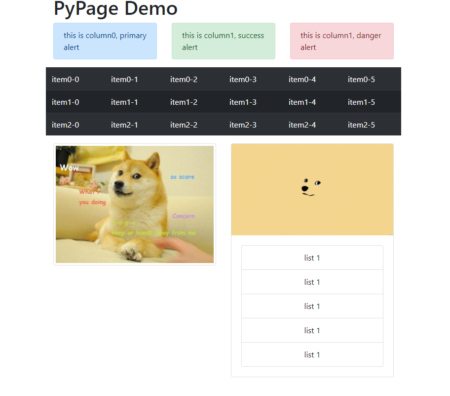

# PyPage

PyPage is a framework that make an backend engineer develop a data driven web application easier.

It is based on Python, with Flask to offer service and bootsrap to offer a neat frontend.

# Usage
In PyPage, all the html page or Jinja2 templates are written by Python, here is a simple hello-world application

```python
from pypage import Page, layout

p = Page(title="hello world!")
p.enable_bootstrap()
img_url = 'https://upload.wikimedia.org/wikipedia/en/5/5f/Original_Doge_meme.jpg'
img_url1 = 'https://snoozepost.com/app/uploads/2016/03/18364-doge-simplistic-doge-min-696x392.png'

with p.body:
    with layout.container():
        Tag('h1', 'PyPage Demo')
        with layout.row():
            cols = [layout.sm_col() for i in range(3)]

        with layout.row():
            with table().set_dark().set_striped() as t:
                for row in range(3):
                    with table.row():
                        for col in range(6):
                            table.col("item%d-%d" % (row, col))
        with layout.row(style="text-align:center;"):
            with layout.sm_col():
                image(img_url, style='width:30px;').set_float_right().set_thumbnail()
            with layout.sm_col():
                c = card()
                c.image(src=img_url1)
                with c.body():
                    li = list_group()
                    for i in range(5):
                        li.item('list 1')

styles = 'primary success danger'.split()
for id, col in enumerate(cols):
    with col0:
        alert(c='this is column0, primary alert').getattr("set_"%styles[id])()

p.display()
```

the above code will start a Flask service at http://127.0.0.1:8081, open it and get following page

<div align="center">
    
</div>


# With Jinja2

```python
State.switch_gstate(State())
with _if_('name is not None'):
    Tag('b', 'hello world')

with _if_('True') as f:
    Tag('b', 'this is true')
    f.add(_stmt_('else'), -1)
    Tag('b', 'this is false')

with _for_('user in names'):
    Tag('h1', 'user %s sex is %s' % (_val_('user.name'),
                                      _val_('user.sex')))

print(State.gstate.compile())
```

and that will get a Jinja2 template like

```html

    <b>
        hello world
    </b>


    <b>
        this is true
    </b>

    <b>
        this is false
    </b>


    <h1>
        user {{ user.name }} sex is {{ user.sex }}
    </h1>

```
